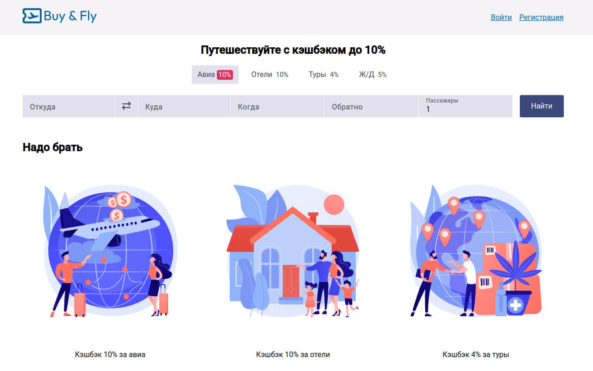

# Buy & Fly

This application is designed to search for cheap flights and book hotels. It is developed using Angular 18, leveraging new features such as Signals. The project relies solely on the standard library, avoiding third-party solutions.

To enhance the user interface, a custom UI Kit has been developed, with minimal usage of Angular CDK components.



### Features
- Flight Search: Find and compare the best flight deals from various airlines.
- Hotel Booking: Book hotels at competitive prices with detailed listings.
- Angular 18: Built using the latest version of Angular, incorporating cutting-edge features and improvements.
- Custom UI Kit: A bespoke UI Kit designed to provide a consistent and intuitive user experience, with limited dependency on Angular CDK.

### Technologies Used
- Angular 18
- Standard Angular Library
- Custom UI Kit
- Angular CDK (minimal usage)

## Getting Started

To get started with the project, clone the repository and install the necessary dependencies:

```bash
git clone git@github.com:Fafnur/buy-and-fly.git
cd buy-and-fly
yarn install
```

Please use Yarn instead of NPM to install dependencies. See: `https://yarnpkg.com/getting-started/install`


Run the development server:

```bash
yarn ng serve
```

Navigate to `http://localhost:4200/` in your browser to see the application in action.

For build: 

```bash
yarn ng build
```

The build artifacts will be stored in the `dist/` directory.

## Contributing

We welcome contributions! Please fork the repository and submit pull requests for any improvements or new features.

## License

This project is licensed under the MIT License - see the `LICENSE` file for details.
